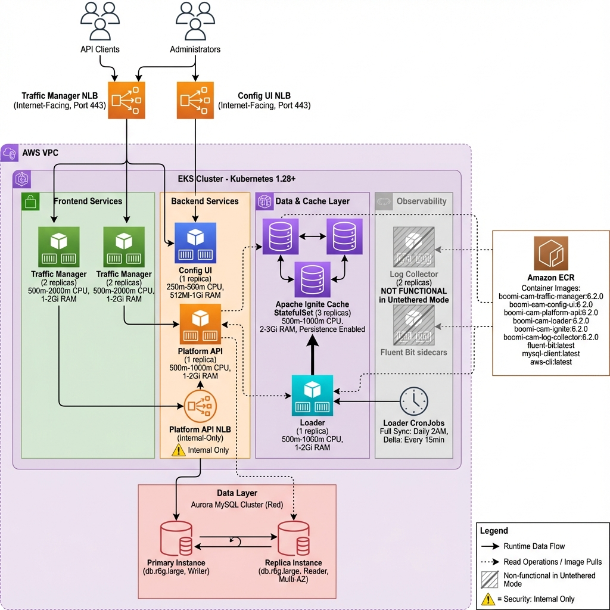

# Deploying Boomi CAM LE 6.2 on AWS EKS in Untethered Mode

This guide covers installation, configuration, validation, and uninstallation of Boomi Cloud API Management Local Edition 6.2 in untethered mode on AWS EKS using automated deployment scripts.

## Introduction

Boomi Cloud API Management Local Edition (CAM LE) delivers enterprise-grade API management capabilities for deployment in private infrastructure. This documentation details the deployment of CAM LE 6.2 in untethered mode (standalone operation without SaaS connectivity) on Amazon EKS with Aurora MySQL.

A complete deployment includes:

- **Traffic Manager** - API gateway for request routing and policy enforcement
- **Platform API** - Administrative API for configuration management
- **Config UI** - Web-based administration interface
- **Cache** - Apache Ignite distributed cache layer
- **Loader** - Data synchronization service
- **Aurora MySQL** - Multi-AZ managed database

**Deployment Duration**: 75-120 minutes

---

## Table of Contents

1. [Architecture Overview](#architecture-overview)
2. [Performance Capacity and Scaling](#performance-capacity-and-scaling)
3. [Prerequisites](#prerequisites)
4. [Quick Start Installation](#quick-start-installation)
5. [Configuration Guide](#configuration-guide)
6. [Validation and Testing](#validation-and-testing)
7. [Accessing CAM LE](#accessing-cam-le)
8. [Uninstallation](#uninstallation)
9. [Troubleshooting](#troubleshooting)
10. [Best Practices](#best-practices)

---

## Architecture Overview

CAM LE deployed on AWS EKS consists of the following components:



*Figure 1: Boomi CAM LE 6.2 deployment architecture on AWS EKS showing component layout, network topology, and data flow patterns.*

### Component Responsibilities

| Component | Purpose | LoadBalancer Type |
|-----------|---------|-------------------|
| **Traffic Manager** | API gateway - handles API requests | Internet-facing |
| **Config UI** | Admin console - manage APIs, policies, users | Internet-facing |
| **Platform API** | Backend API - internal admin operations | Internal only |
| **Cache** | Distributed cache - API definitions, tokens | ClusterIP |
| **Loader** | Data sync - keeps cache up-to-date | ClusterIP |
| **Aurora MySQL** | Persistent storage - all configurations | Private |

### Performance Capacity and Scaling

#### Current Configuration Capacity

The default deployment configuration supports:

| Metric | Capacity | Notes |
|--------|----------|-------|
| **Queries Per Second (QPS)** | 500-750 sustained | Based on 2 Traffic Manager replicas |
| **Concurrent Connections** | ~100-150 | Limited by database and pod resources |
| **Database Connections** | 92 active / 200 max | db.r6g.large capacity |
| **Use Case** | Dev/Test, Light Production | Suitable for staging environments |

**Component Configuration**:
- Traffic Manager: 2 replicas (500m-2000m CPU, 1-2Gi RAM)
- Platform API: 1 replica (500m-1000m CPU, 1-2Gi RAM, internal-only)
- Config UI: 1 replica (250m-500m CPU, 512Mi-1Gi RAM)
- Cache: 3 replicas (500m-1000m CPU, 2-3Gi RAM)
- Aurora MySQL: db.r6g.large (2 vCPU, 16GB RAM, Multi-AZ)

#### Scaling to 1500 QPS

To handle **1500 QPS** sustained traffic, apply these upgrades:

**1. Scale Traffic Manager Pods**

Update `cam-le-untethered-values.yaml`:
```yaml
trafficmanager:
  replicas: 6  # Increase from 2 to 6
  resources:
    requests:
      cpu: "500m"
      memory: "1Gi"
    limits:
      cpu: "2000m"
      memory: "2Gi"
```

**2. Upgrade Aurora Database**

```bash
# Upgrade to db.r6g.2xlarge (8 vCPU, 64GB RAM)
aws rds modify-db-instance \
  --db-instance-identifier cam-le-aurora-primary \
  --db-instance-class db.r6g.2xlarge \
  --apply-immediately

# Also upgrade replica
aws rds modify-db-instance \
  --db-instance-identifier cam-le-aurora-replica \
  --db-instance-class db.r6g.2xlarge \
  --apply-immediately
```

**3. Deploy Across Multiple Availability Zones**

For production resilience, configure EKS across 3 AZs in `ekscluster-config.yaml`:
```yaml
availabilityZones: 
  - us-east-1a
  - us-east-1b
  - us-east-1c
```

**4. Enable Horizontal Pod Autoscaling (Optional)**

```bash
kubectl autoscale deployment trafficmanager \
  --namespace camle \
  --min=4 --max=12 \
  --cpu-percent=70
```

#### Scaling Summary Table

| QPS Target | Traffic Manager Replicas | Aurora Instance | Cache Replicas |
|------------|-------------------------|-----------------|----------------|
| **500-750** (Current) | 2 | db.r6g.large | 3 |
| **1500** | 6 | db.r6g.2xlarge | 3 |
| **3000** | 12 | db.r6g.4xlarge | 3 |

> **Note**: Performance varies based on payload size, API complexity, and backend response times. These estimates assume medium-complexity APIs with sub-100ms backend latency.

#### Performance Optimization Tips

1. **Connection Pool Tuning**: Current deployment uses 2x default connection pools (16 vs 8). Acceptable for medium load.
2. **Cache Hit Ratio**: Monitor cache performance; 90%+ hit ratio is optimal
3. **Database Query Optimization**: Enable slow query logging for queries >100ms
4. **Multi-AZ Deployment**: Distribute pods across availability zones for fault tolerance

---

## Prerequisites

### Required Tools

Install and configure the following tools before deployment:

| Tool | Version | Purpose |
|------|---------|---------|
| **AWS CLI** | v2.x | Interact with AWS services |
| **kubectl** | v1.25+ | Manage Kubernetes resources |
| **eksctl** | v0.150+ | Create and manage EKS clusters |
| **Helm** | v3.x | Deploy CAM LE via Helm charts |
| **Docker or Podman** | Latest | Build container images |
| **MySQL Client** | 8.0+ | Database initialization (optional) |
| **jq** | Latest | JSON processing |

### Verify Installation

```bash
# Check all prerequisites
aws --version
kubectl version --client
eksctl version
helm version
docker --version  # or: podman --version
mysql --version
jq --version
```

### AWS Configuration

Configure AWS credentials with appropriate permissions:

```bash
aws configure
# Provide AWS Access Key ID
# Provide AWS Secret Access Key
# Set default region (ap-southeast-2)

# Verify credentials
aws sts get-caller-identity
```

### Required AWS Permissions

The IAM user or role requires permissions for:
- **EKS**: Cluster creation and deletion
- **EC2**: VPC, subnet, and security group management
- **RDS**: Aurora cluster operations
- **ECR**: Repository management and image operations
- **IAM**: Service account and role management
- **Elastic Load Balancing**: Load balancer creation

---

## Quick Start Installation

### Step 1: Download CAM LE Package

Obtain the Boomi CAM LE 6.2 package and navigate to the deployment directory:

```bash
cd /path/to/Boomi_Cam_Local_6_2_0_GA_346/cam-le-ut-aws-eks-deployment
```

### Step 2: Create Configuration File

Copy and customize the configuration template:

```bash
cp my-config.env.template my-config.env
vim my-config.env
```

### Step 3: Configure Essential Settings

Edit `my-config.env` with the following critical parameters:

```bash
#========================================
# AWS Configuration
#========================================
export CAM_AWS_REGION=ap-southeast-2
export CAM_CLUSTER_NAME=cam-le-prod-cluster

#========================================
# Kubernetes Configuration  
#========================================
export CAM_K8S_NAMESPACE=camle
export CAM_APIM_CLUSTER_NAME=camle-prod

#========================================
# Database Configuration
#========================================
export CAM_DB_CLUSTER_NAME=cam-le-aurora-prod
export CAM_DB_INSTANCE_NAME=cam-le-aurora-prod-instance
export CAM_DB_INSTANCE_CLASS=db.r6g.large
export CAM_DB_USERNAME=admin
export CAM_DB_NAME=masherysolar

#========================================
# CRITICAL: Set Secure Passwords
#========================================
# Use strong, unique passwords for production
export CAM_DB_PASSWORD='YourSecureDBPassword123!'
export CAM_DML_PASSWORD='YourDMLPassword123!'
export CAM_ADMIN_PASSWORD='YourAdminPassword123!'
```

> **WARNING**: Replace placeholder passwords with strong credentials. Do not commit passwords to version control.

### Step 4: Run the Deployment

Load the configuration and execute the automated deployment:

```bash
source my-config.env
./deploy-cam-le-untethered-complete.sh --interactive
```

Interactive mode provides phase-by-phase control:
- Review upcoming operations
- Pause on errors
- Resume from specific phases

For unattended deployment:

```bash
./deploy-cam-le-untethered-complete.sh --auto
```

---

## Configuration Guide

### Understanding Deployment Phases

The automated script executes **11 phases**:

| Phase | Description | Duration | What It Does |
|-------|-------------|----------|--------------|
| **1** | Check Prerequisites | 1 min | Validates all required tools are installed |
| **2** | Setup Environment | 1 min | Configures AWS credentials and variables |
| **3** | Generate Custom Values | 1 min | Creates Area UUID, Package Key/Secret |
| **4** | Create EKS Cluster | 15-20 min | Provisions managed Kubernetes cluster |
| **5** | Create Aurora Database | 10-15 min | Sets up multi-AZ MySQL database |
| **6** | Initialize Database | 5-10 min | Creates 139 tables and schema |
| **6b** | Create Namespace | 1 min | Sets up Kubernetes namespace |
| **7** | Build & Push Images | 30-60 min | Builds 9 Docker images, pushes to ECR |
| **8** | Create Secrets | 2 min | Creates 14 Kubernetes secrets |
| **9** | Create Helm Values | 2 min | Generates Helm configuration |
| **9b** | Fix Load Balancer IAM | 1 min | Configures IAM permissions |
| **10** | Deploy CAM LE | 15-20 min | Installs via Helm, starts pods |
| **11** | Verify Deployment | 5 min | Validates all components are healthy |

**Total Time**: 75-120 minutes

### Resume from Specific Phase

If deployment fails or is interrupted, resume from a specific phase:

```bash
# Resume from phase 7 (build images)
./deploy-cam-le-untethered-complete.sh --start-from 7

# Resume from phase 10 (deploy Helm)
./deploy-cam-le-untethered-complete.sh --start-from 10
```

### Custom Values for Untethered Mode

**CRITICAL REQUIREMENT**: CAM LE untethered mode requires three auto-generated values:

1. **Area UUID** - Unique identifier for OAuth scope
2. **Package API Key** - Authentication key for ConfigUI-Platform API communication
3. **Package API Secret** - Secret for API key authentication

The deployment script automatically generates these during Phase 3 using `scripts/customize.sh`. Missing or incorrect values cause Platform API HTTP 500 errors.

Generated values save to `custom-cam-le.env`:

```bash
cat custom-cam-le.env
```

---

## Validation and Testing

### Step 1: Check Deployment Status

After deployment completes, verify all components are running:

```bash
# Check all pods are running
kubectl get pods -n camle

# Expected output (all pods should be Running with 2/2 due to fluentd sidecar):
# NAME                                    READY   STATUS    RESTARTS   AGE
# cache-statefulset-0                     2/2     Running   0          10m
# cache-statefulset-1                     2/2     Running   0          10m
# cache-statefulset-2                     2/2     Running   0          10m
# configui-deploy-xxx                     2/2     Running   0          10m
# loader-deploy-xxx                       2/2     Running   0          10m
# platformapi-deploy-xxx                  2/2     Running   0          10m
# trafficmanager-deploy-xxx               2/2     Running   0          10m
# trafficmanager-deploy-yyy               2/2     Running   0          10m
```

### Step 2: Get Service Endpoints

Retrieve the LoadBalancer URLs:

```bash
# Get all services
kubectl get svc -n camle

# Get Config UI URL
kubectl get svc configui-svc -n camle -o jsonpath='{.status.loadBalancer.ingress[0].hostname}'

# Get Traffic Manager URL
kubectl get svc trafficmanager-svc -n camle -o jsonpath='{.status.loadBalancer.ingress[0].hostname}'
```

> **Note**: LoadBalancer DNS names require 2-3 minutes to become active after creation.

### Step 3: Validate Platform API (Internal)

Platform API operates in internal-only mode for security. Test from within the cluster:

```bash
# Method 1: Run curl pod in cluster
kubectl run curl-test --rm -i --restart=Never \
  --image=curlimages/curl:latest \
  -n camle \
  -- curl -k -s http://platformapi-svc:8080/platform/ping

# Expected response:
# {"status":"UP"}
```

```bash
# Method 2: Exec into Platform API pod
PAPI_POD=$(kubectl get pods -n camle -l app=platformapi-deploy -o jsonpath='{.items[0].metadata.name}')
kubectl exec -n camle $PAPI_POD -c platformapi -- \
  curl -s http://localhost:8080/platform/ping
```

### Step 4: Check Component Logs

Verify each component started successfully:

```bash
# Config UI logs
kubectl logs -n camle -l app=configui-deploy -c configui --tail=50

# Platform API logs
kubectl logs -n camle -l app=platformapi-deploy -c platformapi --tail=50

# Traffic Manager logs
kubectl logs -n camle -l app=trafficmanager-deploy -c trafficmanager --tail=50

# Cache logs
kubectl logs -n camle cache-statefulset-0 --tail=50

# Loader logs
kubectl logs -n camle -l app=loader-deploy -c loader --tail=50
```

Verify successful component startup:
- `Started` or `Running` messages
- Successful database connections 
- Cache initialization
- No `ERROR` or `FATAL` messages

### Step 5: Verify Database Connectivity

Check that all components can connect to Aurora:

```bash
# Run MySQL client in cluster
kubectl run mysql-client --rm -it --restart=Never \
  --image=mysql:8.0 -n camle \
  -- mysql -h <db-endpoint> -u masheryonprem -p

# Enter DML password when prompted

# Verify tables were created
mysql> USE masherysolar;
mysql> SHOW TABLES;
# Should show 139 tables
mysql> SELECT COUNT(*) FROM information_schema.tables WHERE table_schema = 'masherysolar';
# Should return 139
```

---

## Accessing CAM LE

### Config UI (Admin Console)

The Config UI provides a web-based interface for managing your API platform.

**Access URL**:
```bash
# Get Config UI URL
CONFIGUI_URL=$(kubectl get svc configui-svc -n camle -o jsonpath='{.status.loadBalancer.ingress[0].hostname}')
echo "Config UI: https://${CONFIGUI_URL}:443"
```

**Default Credentials**:
- **Username**: `admin`
- **Password**: Your `CAM_ADMIN_PASSWORD` from `my-config.env`

**First Login Steps**:

1. Navigate to the Config UI URL in your browser
2. Accept the self-signed certificate warning (for testing)
3. Enter username `admin` and your admin password
4. You should see the CAM LE dashboard

> **Production Note**: Replace self-signed certificates with CA-signed SSL certificates for production environments.

### Traffic Manager (API Gateway)

The Traffic Manager handles all API traffic.

**Access URL**:
```bash
# Get Traffic Manager URL
TM_URL=$(kubectl get svc trafficmanager-svc -n camle -o jsonpath='{.status.loadBalancer.ingress[0].hostname}')
echo "Traffic Manager: https://${TM_URL}:443"
```

**Test API Request**:
```bash
# Test the platform ping endpoint
curl -k https://${TM_URL}:443/ping

# Expected: HTTP 200 response
```

### View Deployment Summary

The deployment script creates a summary file with all access information:

```bash
# View deployment summary
cat deployment-summary.txt
```

This includes:
- All service URLs
- Admin credentials
- Database connection details
- ECR registry information

---

## Uninstallation

When you're done testing or need to remove the deployment, use the cleanup script to delete **all resources**.

### Warning

The cleanup script permanently deletes:
- Helm deployment
- All Kubernetes resources (pods, services, secrets)
- EKS cluster (entire cluster)
- Aurora database cluster (all data)
- ECR repositories (all images)
- Generated configuration files

**This action cannot be undone!**

### Run Cleanup Script

```bash
# Navigate to deployment folder
cd cam-le-ut-aws-eks-deployment

# Run cleanup script
./cleanup-all-resources.sh
```

The script will:

1. **Prompt for confirmation** - Type `YES` to proceed
2. **Remove Helm deployment** - Uninstalls CAM LE from Kubernetes
3. **Delete Kubernetes resources** - Removes all pods, services, secrets
4. **Delete EKS cluster** - Takes 10-15 minutes
5. **Delete Aurora database** - Removes cluster and instances
6. **Delete ECR repositories** - Removes all container images
7. **Clean local files** - Removes generated config files

### Cleanup Script Output

```bash
$ ./cleanup-all-resources.sh

========================================
  CAM LE Complete Cleanup Script
========================================

WARNING: This will delete ALL resources:
  - Helm deployment (cam-le)
  - All Kubernetes resources in namespace
  - EKS cluster (entire cluster)
  - Aurora Database Cluster
  - ECR Repositories and images
  - All Kubernetes secrets

Are you sure you want to continue? Type 'YES' to confirm: YES

=== Phase 1: Removing Helm Deployment ===
release "cam-le" uninstalled

=== Phase 2: Deleting Kubernetes Resources ===
Deleting all resources in namespace: camle
namespace "camle" deleted

=== Phase 3: Deleting EKS Cluster ===
Deleting EKS cluster: cam-le-prod-cluster
This will take 10-15 minutes...
[15 minutes later...]
EKS cluster deleted

=== Phase 4: Deleting Aurora Database ===
Deleting Aurora cluster: cam-le-aurora-prod
  Deleting instance: cam-le-aurora-prod-instance
  Deleting cluster...
Aurora cleanup initiated (will complete in background)

=== Phase 5: Deleting ECR Repositories ===
Deleting ECR repositories...
  Deleting: cam-le/apim-le-cache
  Deleting: cam-le/apim-le-configui
  [... 7 more repositories ...]

=== Phase 6: Cleaning Up Local Files ===
Removing generated configuration files...
Local files cleaned

========================================
Cleanup Complete!
========================================
```

### Verify Cleanup

After cleanup completes, verify all resources are deleted:

```bash
# Check EKS cluster (should return error)
eksctl get cluster --name cam-le-prod-cluster --region ap-southeast-2

# Check Aurora (should return empty)
aws rds describe-db-clusters --region ap-southeast-2

# Check ECR repositories (should return empty or error)
aws ecr describe-repositories --region ap-southeast-2 | grep cam-le
```

### Partial Cleanup

If you want to keep certain resources (e.g., database for backup), manually delete resources:

```bash
# Delete only Helm deployment
helm uninstall cam-le -n camle

# Delete only EKS cluster
eksctl delete cluster --name cam-le-prod-cluster --region ap-southeast-2
```

---

## Troubleshooting

### Common Issues and Solutions

#### Issue 1: Platform API Returns HTTP 500

**Symptoms**: ConfigUI can't connect, Platform API logs show errors

**Cause**: Missing or incorrect Area UUID, Package Key, or Package Secret

**Solution**:
```bash
# Verify custom values were generated
cat custom-cam-le.env

# If empty or missing, regenerate:
cd ..  # Go to parent directory
./scripts/customize.sh -u -k -s -b > cam-le-ut-aws-eks-deployment/custom-values.txt

# Update Helm values and redeploy
cd cam-le-ut-aws-eks-deployment
./deploy-cam-le-untethered-complete.sh --start-from 9
```

#### Issue 2: Pods Stuck in ImagePullBackOff

**Symptoms**: Pods can't pull images from ECR

**Cause**: ECR authentication expired or missing

**Solution**:
```bash
# Recreate ECR pull secret
kubectl delete secret ecr-registry-secret -n camle

# Get AWS account and region
export AWS_ACCOUNT_ID=$(aws sts get-caller-identity --query Account --output text)
export AWS_REGION=ap-southeast-2

# Create new secret
kubectl create secret docker-registry ecr-registry-secret \
  --docker-server=${AWS_ACCOUNT_ID}.dkr.ecr.${AWS_REGION}.amazonaws.com \
  --docker-username=AWS \
  --docker-password=$(aws ecr get-login-password --region ${AWS_REGION}) \
  -n camle

# Restart pods
kubectl rollout restart deployment -n camle
```

#### Issue 3: Database Connection Failures

**Symptoms**: Pods crash with database connection errors

**Cause**: Security group doesn't allow MySQL traffic from EKS

**Solution**:
```bash
# Get security group IDs
source db-config.env
EKS_SG=$(aws eks describe-cluster --name ${CAM_CLUSTER_NAME} \
  --region ${CAM_AWS_REGION} \
  --query 'cluster.resourcesVpcConfig.clusterSecurityGroupId' \
  --output text)

# Add ingress rule
aws ec2 authorize-security-group-ingress \
  --group-id ${DB_SECURITY_GROUP_ID} \
  --protocol tcp \
  --port 3306 \
  --source-group ${EKS_SG} \
  --region ${CAM_AWS_REGION}
```

#### Issue 4: LoadBalancers Stuck in Pending

**Symptoms**: `kubectl get svc` shows LoadBalancers in `<pending>` state

**Cause**: AWS Load Balancer Controller not installed or missing IAM permissions

**Solution**:
```bash
# Check if controller is running
kubectl get deployment -n kube-system aws-load-balancer-controller

# If not found, install it
./install-aws-lb-controller.sh

# Check controller logs
kubectl logs -n kube-system deployment/aws-load-balancer-controller
```

#### Issue 5: Cache Pods Won't Start

**Symptoms**: Apache Ignite cache pods in CrashLoopBackOff

**Cause**: Insufficient memory or discovery issues

**Solution**:
```bash
# Check cache pod logs
kubectl logs -n camle cache-statefulset-0

# Increase memory allocation in Helm values
# Edit cam-le-untethered-values.yaml:
# cache:
#   resources:
#     limits:
#       memory: "4Gi"

# Redeploy
helm upgrade cam-le ../deploy/cam-le-chart \
  -f cam-le-untethered-values.yaml \
  -n camle
```

### Viewing Logs

**All component logs**:
```bash
# Get logs from all CAM LE pods
kubectl logs -n camle --all-containers=true -l app.kubernetes.io/name=cam-le --tail=100
```

**Specific component logs**:
```bash
# Config UI
kubectl logs -n camle -l app=configui-deploy -c configui --tail=100 -f

# Platform API
kubectl logs -n camle -l app=platformapi-deploy -c platformapi --tail=100 -f

# Traffic Manager
kubectl logs -n camle -l app=trafficmanager-deploy -c trafficmanager --tail=100 -f
```

### Getting Help

If you encounter issues not covered here:

1. Check the detailed deployment guide: `UNTETHERED-DEPLOYMENT-GUIDE.md`
2. Review platform API validation: `PLATFORM-API-VALIDATION.md`
3. Consult Boomi official documentation
4. Check kubectl events: `kubectl get events -n camle --sort-by='.lastTimestamp'`

---

## Best Practices

### Security

1. **Use Strong Passwords**
   - Generate passwords with at least 16 characters
   - Use a password manager
   - Never commit passwords to version control

2. **Replace Self-Signed Certificates**
   ```bash
   # For production, use proper SSL certificates
   # Update keystores with your CA-signed certificates
   ```

3. **Restrict LoadBalancer Access**
   - Use AWS security groups to limit access
   - Consider using internal LoadBalancers + VPN
   - Enable AWS WAF for Traffic Manager

4. **Enable Database Encryption**
   ```bash
   # Modify aurora-mysql.sh to enable encryption:
   # --storage-encrypted
   ```

### High Availability

1. **Multi-AZ Deployment**
   - Aurora database is already multi-AZ
   - Ensure EKS nodes span multiple AZs
   - Use at least 3 nodes for production

2. **Increase Replicas**
   ```yaml
   # In cam-le-untethered-values.yaml
   trafficmanager:
     replicas: 3  # Increase from 2
   
   platformapi:
     replicas: 2  # Increase from 1
   ```

3. **Configure Auto-Scaling**
   ```bash
   # Enable cluster autoscaler
   eksctl create iamserviceaccount \
     --name cluster-autoscaler \
     --namespace kube-system \
     --cluster cam-le-prod-cluster \
     --attach-policy-arn arn:aws:iam::aws:policy/AutoScalingFullAccess \
     --approve
   ```

### Performance

1. **Right-Size Your Infrastructure**
   - **Traffic Manager**: `t3.xlarge` nodes, 2+ replicas
   - **Cache**: `m5.xlarge` nodes, 3+ replicas
   - **Database**: `db.r6g.large` or larger for production

2. **Monitor Resource Usage**
   ```bash
   # Install metrics server
   kubectl apply -f https://github.com/kubernetes-sigs/metrics-server/releases/latest/download/components.yaml
   
   # View resource usage
   kubectl top nodes
   kubectl top pods -n camle
   ```

3. **Tune Database Connection Pools**
   ```yaml
   # In cam-le-untethered-values.yaml
   trafficmanager:
     datasource:
       pool:
         maxActive: 32  # Increase for high traffic
         maxIdle: 16
   ```

### Cost Optimization

1. **Use Spot Instances for Non-Critical Workloads**
   ```yaml
   # In ekscluster-config.yaml
   managedNodeGroups:
     - name: spot-nodes
       instanceTypes: ["t3.xlarge", "t3a.xlarge"]
       spot: true
   ```

2. **Enable Auto-Shutdown for Dev/Test**
   ```bash
   # Stop EKS nodes during off-hours
   # Use AWS Instance Scheduler
   ```

3. **Monitor Costs**
   ```bash
   # Enable Cost Explorer
   # Tag all resources with Environment=dev/prod
   ```

### Backup and Recovery

1. **Enable Aurora Automated Backups**
   ```bash
   # Aurora backups are enabled by default
   # Verify backup retention:
   aws rds describe-db-clusters \
     --db-cluster-identifier cam-le-aurora-prod \
     --query 'DBClusters[0].BackupRetentionPeriod'
   ```

2. **Export Helm Values**
   ```bash
   # Save your Helm values for disaster recovery
   cp cam-le-untethered-values.yaml ~/backups/cam-le-values-$(date +%Y%m%d).yaml
   ```

3. **Document Custom Configurations**
   - Keep a runbook of all customizations
   - Store configuration files in secure storage (AWS S3 with encryption)

---

## Conclusion

This guide detailed the deployment, validation, and uninstallation procedures for Boomi CAM LE 6.2 in untethered mode on AWS EKS.

**Key Points**:

- Automated deployment completes in 75-120 minutes across 11 phases
- Infrastructure provisioning through application deployment fully automated
- Production-ready architecture implements high availability and security controls
- Single-script cleanup removes all deployed resources
- Comprehensive validation procedures ensure component health

### Next Steps

1. **Configure Initial API Services**
   - Access Config UI
   - Define API services and endpoints
   - Configure policies and security controls
   - Test routing through Traffic Manager

2. **Implement Monitoring**
   - Deploy Prometheus and Grafana stack
   - Configure CloudWatch integration
   - Establish alerting thresholds

3. **Establish CI/CD Pipeline**
   - Automate API configuration deployments
   - Implement version control for configurations
   - Integrate with existing DevOps tooling

4. **Production Readiness**
   - Complete security hardening review
   - Size infrastructure for expected load
   - Configure backup and disaster recovery

### Additional Resources

- **Official Documentation**: [Boomi Cloud API Management Docs](https://help.boomi.com/)
- **Deployment Guide**: `UNTETHERED-DEPLOYMENT-GUIDE.md` (deployment folder)
- **Platform API Validation**: `PLATFORM-API-VALIDATION.md` (deployment folder)
- **AWS EKS Best Practices**: https://aws.github.io/aws-eks-best-practices/
