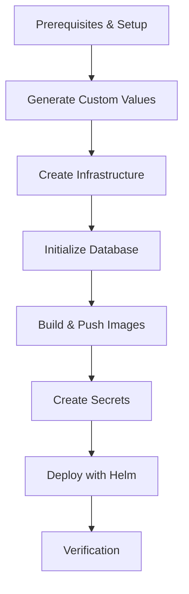

# CAM LE 6.2 Untethered Mode - Complete Deployment Guide for AWS EKS

This guide provides step-by-step instructions for deploying Boomi Cloud API Management Local Edition 6.2 in **untethered mode** on AWS EKS and MySQL Aurora.

## ⚠️ Critical Requirements for Untethered Mode

The Platform API HTTP 500 error is typically caused by missing or incorrectly configured custom values. For untethered mode deployment, you **MUST** generate and configure the following three values using `scripts/customize.sh`:

1. **Area UUID** (`global.localDevOAuthScope`) - Used for OAuth scope and area identification
2. **Package API Key** (`preInstallDBPrep.apiKey`) - Used by ConfigUI to invoke Platform API
3. **Package API Secret** (`preInstallDBPrep.apiSecret`) - Secret for API key authentication

If these values are not properly generated and configured, the preInstallDBPrep job will fail with validation errors, and Platform API will return HTTP 500 errors.

---

## 🚀 Quick Start - Automated Deployment

For a simplified deployment experience, use the automated deployment script `deploy-cam-le-untethered-complete.sh` which handles all phases automatically in a interactive mode.

### Prerequisites

Ensure you have the following tools installed:
- AWS CLI v2.x (configured with credentials)
- kubectl v1.25+
- eksctl v0.150+
- Helm v3.x
- Docker or Podman
- MySQL client
- jq (JSON processor)

### Step 1: Navigate to Deployment Folder

```bash
cd install-untethered-camle-aws
```

### Step 2: Configure Environment

Create your configuration file from the template:

```bash
# Copy template and customize
cp my-config.env.template my-config.env
vi my-config.env

# Required configurations:
export CAM_AWS_REGION=ap-southeast-2
export CAM_CLUSTER_NAME=cam-le-prod-cluster
export CAM_K8S_NAMESPACE=default
export CAN_APIM_CLUSTER_NAME=camle-test

# Database configuration
export CAM_DB_CLUSTER_NAME=cam-le-aurora-prod
export CAM_DB_INSTANCE_NAME=cam-le-aurora-db-1
export CAM_DB_INSTANCE_CLASS=db.r6g.large

# REQUIRED: Set secure passwords
export CAM_DB_PASSWORD='YourSecureDBPassword123!'
export CAM_DML_PASSWORD='YourDMLPassword123!'
export CAM_ADMIN_PASSWORD='YourAdminPassword123!'
```

### Step 3: Run Automated Deployment

```bash
# Load configuration
source my-config.env

# Run deployment script (interactive mode recommended)
./deploy-cam-le-untethered-complete.sh --interactive

# Or run in automatic mode
./deploy-cam-le-untethered-complete.sh --auto
```

### High-Level Deployment Phases

The automated script executes the following phases:

| Phase | Description | Duration |
|-------|-------------|----------|
| **1** | Check Prerequisites | 1 min |
| **2** | Setup Environment | 1 min |
| **3** | Generate Custom Values (Area UUID, Package Key/Secret) | 1 min |
| **4** | Create EKS Cluster with 2-5 nodes | 15-20 min |
| **5** | Create Aurora MySQL Database | 10-15 min |
| **6** | Initialize Database Schema (4 SQL files, 139 tables) + Create Namespace | 5-10 min |
| **7** | Build & Push Docker Images to ECR | 30-60 min |
| **8** | Create All Kubernetes Secrets (14 secrets) | 2 min |
| **9** | Create Helm Values File + Fix LB IAM | 2 min |
| **10** | Deploy CAM LE with Helm | 15-20 min |
| **11** | Verify Deployment | 5 min |

**Total Estimated Time**: 75-120 minutes

### Step 3: Access CAM LE

After deployment completes:

```bash
# Get service URLs
kubectl get svc -n camle

# Access Config UI
# URL: https://<configui-loadbalancer>:443
# Username: admin
# Password: <CAM_ADMIN_PASSWORD>
```

### Troubleshooting

If deployment fails at any phase:

```bash
# Resume from specific phase (e.g., phase 6)
./deploy-cam-le-untethered-complete.sh --start-from 6

# Check pod logs
kubectl logs <pod-name> -n camle

# View deployment events
kubectl get events -n camle --sort-by='.lastTimestamp'
```

---

## 📖 Detailed Manual Deployment

For manual step-by-step deployment or to understand what the automated script does, follow the detailed phases below.

---

## Overview

This deployment consists of the following phases:



**Estimated Total Time**: 75-120 minutes

---

## Phase 1: Prerequisites

### Required Tools

- **AWS CLI** v2.x configured with credentials
- **kubectl** v1.25+
- **eksctl** v0.150+
- **Helm** v3.x
- **Docker** or **Podman**
- **MySQL client** (for database initialization)
- **jq** (for JSON processing)

### Verify Installation

```bash
aws --version
kubectl version --client
eksctl version
helm version
docker --version  # or podman --version
mysql --version
jq --version
```

### Set Environment Variables

```bash
export AWS_REGION=us-east-1
export AWS_ACCOUNT_ID=$(aws sts get-caller-identity --query Account --output text)
export CLUSTER_NAME=cam-le-cluster
export DB_PASSWORD='YourSecureDBPassword123!'
export DML_PASSWORD='YourDMLPassword123!'
export ADMIN_PASSWORD='YourAdminPassword123!'
```

---

## Phase 2: Generate Custom Values for Untethered Mode

> [!IMPORTANT]
> **This is the most critical step**. Skipping or incorrectly executing this step will cause the HTTP 500 error.

### Step 2.1: Generate All Custom Values

```bash
# Navigate to deployment folder
cd install-untethered-camle-aws

# Generate Area UUID, Package Key, and Package Secret
../scripts/customize.sh -u -k -s -b > custom-values.txt

# Parse the output
export AREA_UUID=$(sed -n '1p' custom-values.txt | tr -d '\n')
export PACKAGE_KEY=$(sed -n '2p' custom-values.txt | tr -d '\n')
export PACKAGE_SECRET=$(sed -n '3p' custom-values.txt | tr -d '\n')

# Verify values were generated
echo "Area UUID: $AREA_UUID"
echo "Package Key: ${PACKAGE_KEY:0:20}..."
echo "Package Secret: ${PACKAGE_SECRET:0:20}..."
```

### Step 2.2: Save to Configuration File

```bash
# Save to environment file
cat > custom-cam-le.env <<EOF
export AREA_UUID="$AREA_UUID"
export PACKAGE_KEY="$PACKAGE_KEY"
export PACKAGE_SECRET="$PACKAGE_SECRET"
export ADMIN_PASSWORD="${ADMIN_PASSWORD}"
export DML_PASSWORD="${DML_PASSWORD}"
export DB_PASSWORD="${DB_PASSWORD}"
export AWS_REGION="${AWS_REGION}"
export AWS_ACCOUNT_ID="${AWS_ACCOUNT_ID}"
export CLUSTER_NAME="${CLUSTER_NAME}"
EOF

echo "✅ Custom values saved to custom-cam-le.env"
```

---

## Phase 3: Create EKS Cluster

### Step 3.1: Create Cluster Configuration

```bash
cat > eks-cluster-config.yaml <<EOF
apiVersion: eksctl.io/v1alpha5
kind: ClusterConfig
metadata:
  name: ${CLUSTER_NAME}
  region: ${AWS_REGION}
  version: "1.31"
vpc:
  cidr: 10.0.0.0/16
  nat:
    gateway: HighlyAvailable
managedNodeGroups:
  - name: cam-le-nodegroup
    instanceType: m5.large
    desiredCapacity: 3
    minSize: 3
    maxSize: 4
    volumeSize: 80
    privateNetworking: true
    labels:
      workload: cam-le
    tags:
      Environment: production
      Application: cam-le
iam:
  withOIDC: true
  serviceAccounts:
    - metadata:
        name: apiml-sa
        namespace: default
      attachPolicyARNs:
        - arn:aws:iam::aws:policy/AmazonS3ReadOnlyAccess
        - arn:aws:iam::aws:policy/CloudWatchAgentServerPolicy
cloudWatch:
  clusterLogging:
    enableTypes: ["api", "audit", "authenticator", "controllerManager", "scheduler"]
EOF
```

### Step 3.2: Create Cluster

```bash
eksctl create cluster -f eks-cluster-config.yaml
# Takes 15-20 minutes

# Verify cluster access
kubectl get nodes
```

### Step 3.3: Install AWS Load Balancer Controller

```bash
./install-aws-lb-controller.sh

# Verify installation
kubectl get deployment -n kube-system aws-load-balancer-controller
```

---

## Phase 4: Create Aurora MySQL Database

### Step 4.1: Update Database Script with Right-Sized Instance

```bash
# Update aurora-mysql.sh to use recommended sizing
sed -i.bak 's/db\.r6g\.xlarge/db.r6g.large/' aurora-mysql.sh

# Update password
sed -i.bak "s/YourSecurePassword123!/${DB_PASSWORD}/" aurora-mysql.sh
```

### Step 4.2: Create Database

```bash
./aurora-mysql.sh
# Takes 10-15 minutes

# Source the database configuration
source db-config.env

echo "Database Endpoint: ${DB_ENDPOINT}"
```

---

## Phase 5: Initialize Database Schema

### Step 5.1: Run Schema Initialization (DDL User)

```bash
# Connect as admin user and create schema
mysql -h ${DB_ENDPOINT} -u ${DB_USERNAME} -p${DB_PASSWORD} <<EOF
-- Create database if not exists
CREATE DATABASE IF NOT EXISTS masherysolar CHARACTER SET utf8mb4 COLLATE utf8mb4_unicode_ci;

-- Grant privileges to admin user for schema creation
GRANT ALL PRIVILEGES ON masherysolar.* TO '${DB_USERNAME}'@'%';
FLUSH PRIVILEGES;

-- Verify
SHOW DATABASES;
EOF
```

### Step 5.2: Create DML User

```bash
# Create application user with limited privileges
mysql -h ${DB_ENDPOINT} -u ${DB_USERNAME} -p${DB_PASSWORD} <<EOF
-- Create DML user
CREATE USER IF NOT EXISTS 'masheryonprem'@'%' IDENTIFIED BY '${DML_PASSWORD}';

-- Grant DML privileges only
GRANT SELECT, INSERT, UPDATE, DELETE, EXECUTE ON masherysolar.* TO 'masheryonprem'@'%';
FLUSH PRIVILEGES;

-- Verify
SELECT User, Host FROM mysql.user WHERE User='masheryonprem';
EOF

echo "✅ DML user created: masheryonprem"
```

---

## Phase 6: Build and Push Docker Images

### Step 6.1: Setup ECR Repositories

```bash
./setup-ecr-and-build.sh
# Takes 30-60 minutes

# Source ECR configuration
source ecr-config.env
```

---

## Phase 7: Create Kubernetes Secrets

> [!IMPORTANT]
> These secrets use the correct key formats required by CAM LE 6.2

### Step 7.1: Create Database Secrets

```bash
# DDL user secret (for schema operations)
kubectl create secret generic db-ddl-cred \
  --from-literal=username=${DB_USERNAME} \
  --from-literal=password=${DB_PASSWORD} \
  -n default --dry-run=client -o yaml | kubectl apply -f -

# DML user secret (for application operations)
kubectl create secret generic apim-db-secret \
  --from-literal=.apimdbuser=masheryonprem \
  --from-literal=.apimdbpasswd=${DML_PASSWORD} \
  -n default --dry-run=client -o yaml | kubectl apply -f -

echo "✅ Database secrets created"
```

### Step 7.2: Create Package Secrets (ConfigUI-Platform API Auth)

```bash
# Package key and secret for ConfigUI to Platform API communication
kubectl create secret generic configui-secrets \
  --from-literal=.mlc_apikey=${PACKAGE_KEY} \
  --from-literal=.mlc_apisecret=${PACKAGE_SECRET} \
  -n default --dry-run=client -o yaml | kubectl apply -f -

echo "✅ Package secrets created"
```

### Step 7.3: Create Admin Password Secret

```bash
# Admin user password
kubectl create secret generic configui-user-secrets \
  --from-literal=.mlc_password=${ADMIN_PASSWORD} \
  --from-literal=.mlc_server_secret=$(openssl rand -base64 32) \
  -n default --dry-run=client -o yaml | kubectl apply -f -

echo "✅ Admin password secret created"
```

### Step 7.4: Create ECR Pull Secret

```bash
kubectl create secret docker-registry ecr-registry-secret \
  --docker-server=${ECR_REGISTRY} \
  --docker-username=AWS \
  --docker-password=$(aws ecr get-login-password --region ${AWS_REGION}) \
  -n default --dry-run=client -o yaml | kubectl apply -f -

echo "✅ ECR pull secret created"
```

### Step 7.5: Create SSL/TLS Keystores

```bash
mkdir -p keystores

# Generate self-signed certificates
openssl req -x509 -newkey rsa:4096 -keyout keystores/key.pem \
  -out keystores/cert.pem -days 365 -nodes \
  -subj "/CN=*.elb.amazonaws.com"

# Create PKCS12 keystores
openssl pkcs12 -export -in keystores/cert.pem -inkey keystores/key.pem \
  -out keystores/trafficmanager-keystore.p12 -name trafficmanager \
  -passout pass:changeit

openssl pkcs12 -export -in keystores/cert.pem -inkey keystores/key.pem \
  -out keystores/platformapi-keystore.p12 -name platformapi \
  -passout pass:changeit

# Create TrafficManager keystore secret
kubectl create secret generic trafficmanager-keystore-secret \
  --from-file=trafficmanager.jks=keystores/trafficmanager-keystore.p12 \
  --from-literal=.ssl.password=changeit \
  --from-literal=.ssl.keypassword=changeit \
  -n default --dry-run=client -o yaml | kubectl apply -f -

# Create PlatformAPI keystore secret
kubectl create secret generic platformapi-keystore-secret \
  --from-file=tml-cm.jks=keystores/platformapi-keystore.p12 \
  --from-literal=.ssl.password=changeit \
  --from-literal=.ssl.keypassword=changeit \
  -n default --dry-run=client -o yaml | kubectl apply -f -

echo "✅ SSL/TLS keystore secrets created"
```

### Step 7.6: Create OAuth Secrets

```bash
kubectl create secret generic oauth-authenticator-secret \
  --from-literal=.oapiusername=$(echo -n "oapiroot" | base64) \
  --from-literal=.oapipassword=$(openssl rand -base64 64) \
  --from-literal=.publickeyname=$(echo -n "public_key" | base64) \
  --from-literal=.publickeyvalue=$(openssl rand -base64 22) \
  --from-literal=.aeadsecret=$(openssl rand -base64 16) \
  --from-literal=.aeadnonce=$(openssl rand -base64 16) \
  -n default --dry-run=client -o yaml | kubectl apply -f -

echo "✅ OAuth secrets created"
```

### Step 7.7: Verify All Secrets

```bash
echo "Verifying all secrets..."
kubectl get secrets -n default | grep -E "apim-db-secret|configui-secrets|configui-user-secrets|ecr-registry-secret|trafficmanager-keystore|platformapi-keystore|oauth-authenticator|db-ddl-cred"
```

---

## Phase 8: Create Helm Values File for Untethered Mode

### Step 8.1: Create Values File with All Required Fields

```bash
# Load environment variables
source custom-cam-le.env
source db-config.env
source ecr-config.env

cat > cam-le-untethered-values.yaml <<EOF
# CAM LE 6.2 Helm Values - Untethered Mode for AWS EKS
# Generated on $(date)

global:
  # CRITICAL: Must be true to proceed with deployment
  acceptEUA: true
  
  # Deployment mode: untethered (standalone) or tethered (SaaS-connected)
  apimClusterMode: untethered
  
  # ECR image registry
  apimImageRegistry: ${ECR_REGISTRY}/cam-le
  
  # Image pull secrets
  imagePullSecrets:
    - name: ecr-registry-secret
  
  imagePullPolicy: IfNotPresent
  
  # Service type for LoadBalancers
  k8sServiceType: LoadBalancer
  
  # Cluster identifier (max 6 alphanumeric characters)
  apimClusterName: camle1
  
  # Admin user for Config UI
  localDevAdminUser: admin
  
  # CRITICAL: Area UUID for OAuth scope (from customize.sh -u)
  localDevOAuthScope: "${AREA_UUID}"
  
  # Enable health probes
  enableProbes: true
  
  # Database configuration
  mysqlDatabase:
    host: ${DB_ENDPOINT}
    port: 3306
    databaseSchema: masherysolar
    role: 'masherySolar'
    sslMode: 'disable'
    mutualTls: 'disable'
    caConfigmap: 'null'
    sslSecret: 'null'
    clientCertConfigmap: 'null'
    clientKeySecret: 'null'
    clientKeystoreSecret: 'null'
    connectTimeout: 4000
    netReadTimeout: 30
    netWriteTimeout: 360
    socketTimeout: 0
  
  # Logging configuration
  logging:
    includeFluentBitContainer: true
    appLogLocation: console
  
  # Verbose logging (disable for production)
  verboseLog: "disable"
  
  # Security context
  securityContext:
    runAsUser: 10001
    runAsGroup: 10001
  
  # Service account
  serviceAccountName: apiml-sa
  
  # Email configuration (log to console for now)
  email:
    mail.transport.protocol: "log"

# Traffic Manager configuration
trafficmanager:
  image: apim-le-trafficmanager
  tag: v6.2.0
  replicas: 2
  logback:
    logLevel: INFO
  resources:
    requests:
      cpu: "500m"
      memory: "1Gi"
    limits:
      cpu: "2000m"
      memory: "2Gi"
  service:
    annotations:
      service.beta.kubernetes.io/aws-load-balancer-type: "nlb"
      service.beta.kubernetes.io/aws-load-balancer-scheme: "internet-facing"
  datasource:
    pool:
      maxActive: 16
      maxIdle: 8

# Platform API configuration
platformapi:
  image: apim-le-platformapi
  tag: v6.2.0
  replicas: 1
  logback:
    logLevel: INFO
  resources:
    requests:
      cpu: "500m"
      memory: "1Gi"
    limits:
      cpu: "1000m"
      memory: "2Gi"
  service:
    annotations:
      service.beta.kubernetes.io/aws-load-balancer-type: "nlb"
      service.beta.kubernetes.io/aws-load-balancer-scheme: "internal"
  datasource:
    pool:
      maxActive: 16
      maxIdle: 8

# Config UI configuration
configui:
  image: apim-le-configui
  tag: v6.2.0
  replicas: 1
  logger:
    logLevel: info
  httpsEnabled: true
  resources:
    requests:
      cpu: "250m"
      memory: "512Mi"
    limits:
      cpu: "500m"
      memory: "1Gi"
  service:
    annotations:
      service.beta.kubernetes.io/aws-load-balancer-type: "nlb"
      service.beta.kubernetes.io/aws-load-balancer-scheme: "internet-facing"
  datasource:
    pool:
      maxActive: 16
      maxIdle: 8

# Loader configuration
loader:
  image: apim-le-loader
  tag: v6.2.0
  replicas: 1
  logback:
    logLevel: INFO
  resources:
    requests:
      cpu: "250m"
      memory: "512Mi"
    limits:
      cpu: "1000m"
      memory: "2Gi"
  datasource:
    pool:
      maxActive: 12
      maxIdle: 6

# Loader Cron Job configuration
loadercron:
  image: apim-le-loader-cron
  tag: v6.2.0
  serviceLoad: true
  fullLoad:
    schedule: "0 2 * * *"
    concurrencyPolicy: Forbid
  deltaLoad:
    schedule: "*/15 * * * *"
    concurrencyPolicy: Forbid
  onpremLoad:
    schedule: "*/15 * * * *"
    concurrencyPolicy: Forbid
  serviceUpdateSince: 15
  mapiLoad: true
  mapiUpdateSince: 15
  packagerLoad: true
  packagerUpdateSince: 15
  devclassLoad: true
  devclassUpdateSince: 15
  httpsClientSecurityLoad: true
  httpsClientSecurityUpdateSince: 15

# Apache Ignite Cache configuration
cache:
  image: apim-le-cache
  tag: v6.2.0
  replicas: 3
  statisticsEnabled: true
  dataRegionMetricsEnabled: false
  allocatedRam:
    memcache:
      initial: 256
      max: 512
    counter:
      initial: 256
      max: 512
    content:
      initial: 256
      max: 512
    service:
      initial: 256
      max: 512
    package:
      initial: 256
      max: 512
    httpssecurity:
      initial: 256
      max: 512
  log4j:
    rootLogLevel: ERROR
    igniteLogLevel: ERROR
    apimLogLevel: INFO
  resources:
    requests:
      cpu: "500m"
      memory: "2Gi"
    limits:
      cpu: "1000m"
      memory: "3Gi"

# Log Collector configuration
logcollector:
  replicas: 2
  logsync:
    image: cam-le-logsync
    tag: v6.2.0
  datasource:
    pool:
      maxActive: 8
      maxIdle: 4
  logback:
    loglevel: INFO

# CRITICAL: Pre-Install Database Preparation Job
# This job MUST have these three values properly set for untethered mode
preInstallDBPrep:
  image: apim-le-toolkit
  tag: v6.2.0
  # CRITICAL: Enable database population for first-time installation
  populateSeedData: true
  # CRITICAL: Package API Key (from customize.sh -k)
  apiKey: "${PACKAGE_KEY}"
  # CRITICAL: Package API Secret (from customize.sh -s)
  apiSecret: "${PACKAGE_SECRET}"
  # DDL user for schema creation
  initDBUserName: ${DB_USERNAME}
  # Area name
  areaName: "CAM LE Local Area"

loaderjob:
  image: apim-le-loader-cron
  tag: v6.2.0
EOF

echo "✅ Helm values file created: cam-le-untethered-values.yaml"
```

---

## Phase 9: Deploy CAM LE with Helm

### Step 9.1: Create Service Account and RBAC

```bash
kubectl apply -f - <<EOF
apiVersion: v1
kind: ServiceAccount
metadata:
  name: apiml-sa
  namespace: default
---
apiVersion: rbac.authorization.k8s.io/v1
kind: Role
metadata:
  name: apiml-role
  namespace: default
rules:
- apiGroups: [""]
  resources: ["pods", "services", "endpoints"]
  verbs: ["get", "list", "watch"]
- apiGroups: [""]
  resources: ["configmaps"]
  verbs: ["get", "list", "watch", "create", "update", "patch"]
---
apiVersion: rbac.authorization.k8s.io/v1
kind: RoleBinding
metadata:
  name: apiml-rolebinding
  namespace: default
subjects:
- kind: ServiceAccount
  name: apiml-sa
  namespace: default
roleRef:
  kind: Role
  name: apiml-role
  apiGroup: rbac.authorization.k8s.io
EOF

echo "✅ Service account and RBAC created"
```

### Step 9.2: Validate Helm Chart

```bash
cd deploy
helm lint . -f ../cam-le-untethered-values.yaml
cd ..
```

### Step 9.3: Dry Run Deployment

```bash
helm install cam-le deploy/ \
  -f cam-le-untethered-values.yaml \
  --set preInstallDBPrep.initDBUserPassword=${DB_PASSWORD} \
  --set preInstallDBPrep.localDevAdminPassword=${ADMIN_PASSWORD} \
  -n default \
  --dry-run --debug | head -200

# Review the output carefully
```

### Step 9.4: Deploy CAM LE

```bash
echo "Deploying CAM LE... This will take 15-20 minutes"

helm install cam-le deploy/ \
  -f cam-le-untethered-values.yaml \
  --set preInstallDBPrep.initDBUserPassword=${DB_PASSWORD} \
  --set preInstallDBPrep.localDevAdminPassword=${ADMIN_PASSWORD} \
  -n default \
  --wait --timeout 20m

echo "✅ CAM LE deployment initiated"
```

### Step 9.5: Monitor Deployment

```bash
# Watch pods
kubectl get pods -n default -w

# Check preinstall job (should complete first)
kubectl get job -n default
kubectl logs job/preinstall-dbload-v6-2-0 -n default

# Check pod status
kubectl get pods -n default
```

---

## Phase 10: Verification

### Step 10.1: Check All Pods are Running

```bash
kubectl get pods -n default

# Expected output:
# NAME                                     READY   STATUS      RESTARTS      AGE
# cache-deploy-869797589b-86rcf            2/2     Running     0             35h
# cache-deploy-869797589b-cj996            2/2     Running     0             35h
# cache-deploy-869797589b-kplr6            2/2     Running     0             35h
# configui-deploy-849bbc4796-75b56         2/2     Running     0             34h
# loader-deploy-8699459c4d-bwgdt           2/2     Running     0             35h
# loader-job-delta-29423700-xwl62          0/1     Completed   0             8m59s
# loader-job-full-29423640-d5rq7           0/1     Completed   0             68m
# mysql-client                             0/1     Completed   0             35h
# platformapi-deploy-7566d6ddd6-c9v2l      2/2     Running     0             35h
# trafficmanager-deploy-86d7dfff46-f6kwt   2/2     Running     0             35h
# trafficmanager-deploy-86d7dfff46-lwsfx   2/2     Running     0             35h
```

### Step 10.2: Get Service URLs

```bash
echo "Waiting for LoadBalancers to provision..."
sleep 60

CONFIGUI_URL=$(kubectl get svc configui-svc -n default -o jsonpath='{.status.loadBalancer.ingress[0].hostname}')
TM_URL=$(kubectl get svc trafficmanager-svc -n default -o jsonpath='{.status.loadBalancer.ingress[0].hostname}')
PAPI_URL=$(kubectl get svc platformapi-svc -n default -o jsonpath='{.status.loadBalancer.ingress[0].hostname}')

echo "========================================="
echo "CAM LE Deployment Complete!"
echo "========================================="
echo "Config UI: https://${CONFIGUI_URL}:443"
echo "Traffic Manager: https://${TM_URL}:443"
echo "Platform API: http://${PAPI_URL}:7080"
echo ""
echo "Login Credentials:"
echo "  Username: admin"
echo "  Password: ${ADMIN_PASSWORD}"
echo "========================================="
```

### Step 10.3: Test Platform API Health

> [!NOTE]
> Platform API is configured as **internal** LoadBalancer (not internet-facing) for security.
> It's only accessible from within the VPC/cluster, not from the public internet.

**Method 1: Test from within the cluster (Recommended)**

```bash
# Run a test pod in the cluster to check Platform API
kubectl run curl-test --rm -i --restart=Never \
  --image=curlimages/curl:latest \
  -n default \
  -- curl -k -s http://platformapi-svc:7080/platform/ping

# Expected output: {"status":"UP"} or similar success response
```

**Method 2: Test via kubectl exec into existing pod**

```bash
# Get a running pod name
PAPI_POD=$(kubectl get pods -n default -l app=platformapi-deploy -o jsonpath='{.items[0].metadata.name}')

# Test internal endpoint
kubectl exec -n default $PAPI_POD -c platformapi -- \
  curl -s http://localhost:7080/platform/ping

# Expected output: {"status":"UP"}
```

**Method 3: Check ConfigUI logs (validates ConfigUI → Platform API connectivity)**

```bash
# ConfigUI should be able to connect to Platform API internally
kubectl logs -n default -l app=configui-deploy -c configui --tail=50 | grep -i "platform\|token\|error"

# Look for successful token generation messages
# Example: "Successfully generated token" or "200 OK"
```

**Method 4: Test from bastion host in same VPC (if available)**

```bash
# If you have a bastion/jump host in the same VPC:
ssh bastion-host

# From bastion, test internal LoadBalancer
PAPI_URL=$(kubectl get svc platformapi-svc -n default -o jsonpath='{.status.loadBalancer.ingress[0].hostname}')
curl -k http://${PAPI_URL}:8080/platform/ping
```

**Expected Behavior:**
- ✅ **Success**: `{"status":"UP"}` or HTTP 200 response
- ❌ **Failure**: HTTP 500 error (missing custom values)
- ❌ **Timeout**: Platform API pod not running or database connectivity issue

### Step 10.4: Verify Database Seed Data

```bash
mysql -h ${DB_ENDPOINT} -u ${DB_USERNAME} -p${DB_PASSWORD} masherysolar <<EOF
-- Check that Area 33 was created with custom UUID
SELECT id, uuid, name, status FROM areas WHERE id = 33;

-- Check package table
SELECT id, name FROM packages LIMIT 5;

-- Check that admin user was created
SELECT username, email FROM developers WHERE username = 'admin';
EOF
```

### Step 10.5: Check Logs for Errors

```bash
# Platform API logs
kubectl logs -l app=platformapi -n default --tail=100

# Traffic Manager logs
kubectl logs -l app=trafficmanager -n default --tail=100

# Loader logs
kubectl logs -l app=loader -n default --tail=100

# PreInstall job logs
kubectl logs job/preinstall-dbload-v6-2-0 -n default
```

---

## Troubleshooting

### Problem: Platform API returns HTTP 500

**Root Cause**: Missing or incorrect custom values (Area UUID, Package Key, Package Secret)

**Solution**:
```bash
# 1. Check if values were set in deployment
kubectl get job preinstall-dbload-v6-2-0 -n default -o yaml | grep -A 5 "CUSTOM_"

# 2. Verify Area UUID in database
mysql -h ${DB_ENDPOINT} -u ${DB_USERNAME} -p${DB_PASSWORD} -e "SELECT uuid FROM masherysolar.areas WHERE id=33;"

# 3. Re-run customize.sh and redeploy
./scripts/customize.sh -u -k -s -b > new-custom-values.txt
# Update values file and redeploy
```

### Problem: PreInstall Job Fails

**Check job logs**:
```bash
kubectl logs job/preinstall-dbload-v6-2-0 -n default

# Common errors:
# - "Customized API Key is not provided" → apiKey not set in values
# - "Customized area UUID not provided" → localDevOAuthScope not set
# - "Database connection failed" → Check DB_ENDPOINT and credentials
```

### Problem: Pods Stuck in Pending

**Check events**:
```bash
kubectl get events -n default --sort-by='.lastTimestamp'

# Common issues:
# - Insufficient resources → Scale up nodes
# - Image pull errors → Check ECR credentials
# - PVC issues → Check storage class
```

### Problem: LoadBalancer URLs Not Resolving

```bash
# Check service status
kubectl get svc -n default

# Check AWS Load Balancer Controller
kubectl logs -n kube-system deployment/aws-load-balancer-controller

# Verify security groups allow traffic
```

---

## Post-Deployment Configuration

### 1. Access Config UI

```bash
# Get URL
CONFIGUI_URL=$(kubectl get svc configui-svc -n default -o jsonpath='{.status.loadBalancer.ingress[0].hostname}')

echo "Config UI (Admin): https://${CONFIGUI_URL}/admin"
echo "Config UI (Dev Portal): https://${CONFIGUI_URL}/"
echo "Username: admin"
echo "Password: ${ADMIN_PASSWORD}"
```

### 2. Create Your First API

1. Log in to Config UI
2. Navigate to **APIs** → **Create New API**
3. Configure endpoint and policies
4. Deploy to Traffic Manager

### 3. Test API Call

```bash
TM_URL=$(kubectl get svc trafficmanager-svc -n default -o jsonpath='{.status.loadBalancer.ingress[0].hostname}')

curl -k -H "Authorization: Bearer <your-api-key>" \
  https://${TM_URL}/your-api-path
```

---

## Cleanup

To completely remove the deployment:

```bash
# Delete Helm release
helm uninstall cam-le -n default

# Delete secrets
kubectl delete secrets -n default --all

# Delete EKS cluster
eksctl delete cluster --name ${CLUSTER_NAME} --region ${AWS_REGION}

# Delete Aurora database
aws rds delete-db-instance --db-instance-identifier cam-le-aurora-instance --skip-final-snapshot
aws rds delete-db-cluster --db-cluster-identifier cam-le-aurora-cluster --skip-final-snapshot

# Delete ECR repositories
for repo in apim-le-trafficmanager apim-le-platformapi apim-le-configui apim-le-loader apim-le-loader-cron apim-le-cache apim-le-toolkit cam-le-logsync; do
  aws ecr delete-repository --repository-name cam-le/${repo} --force
done
```

---

## Summary of Critical Steps for Untethered Mode

1. ✅ **Generate custom values** using `./scripts/customize.sh -u -k -s -b`
2. ✅ **Set Area UUID** in `global.localDevOAuthScope`
3. ✅ **Set Package Key** in `preInstallDBPrep.apiKey`
4. ✅ **Set Package Secret** in `preInstallDBPrep.apiSecret`
5. ✅ **Set populateSeedData** to `true` for first-time installation
6. ✅ **Pass passwords** via `--set` command line parameters
7. ✅ **Verify preInstall job** completes successfully before troubleshooting pods

Following these steps precisely will prevent the HTTP 500 error and ensure a successful untethered deployment.
